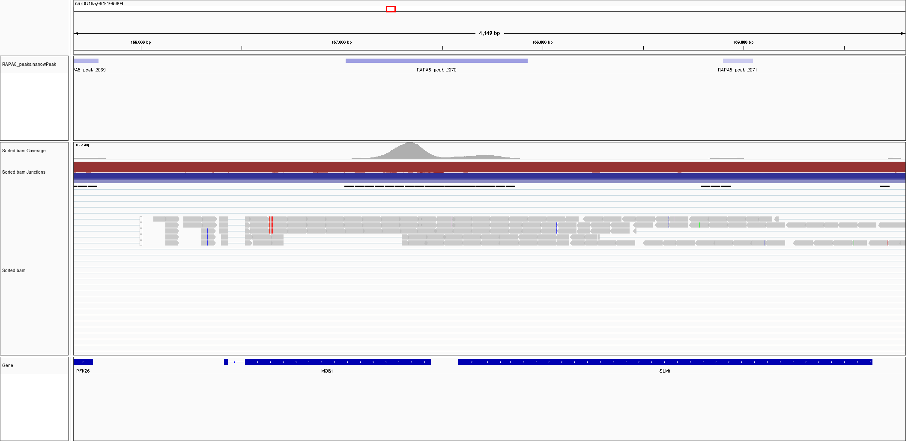
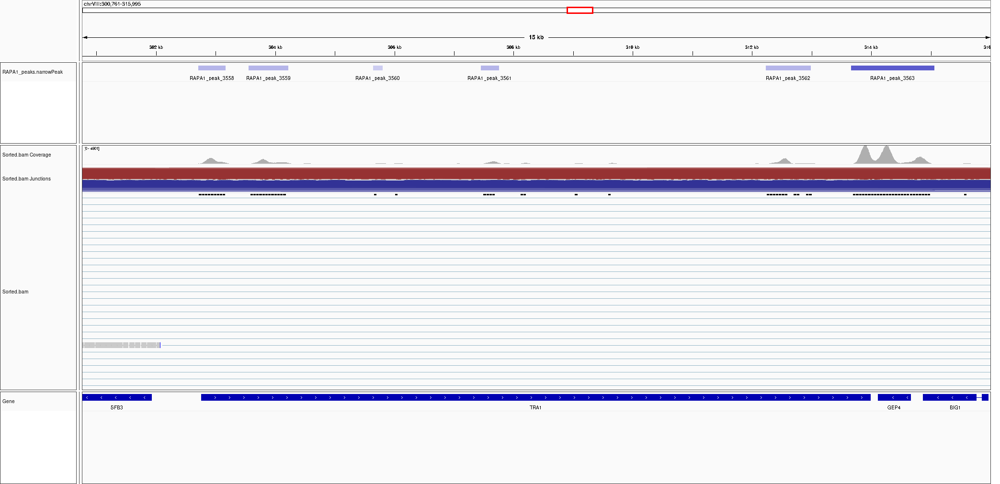
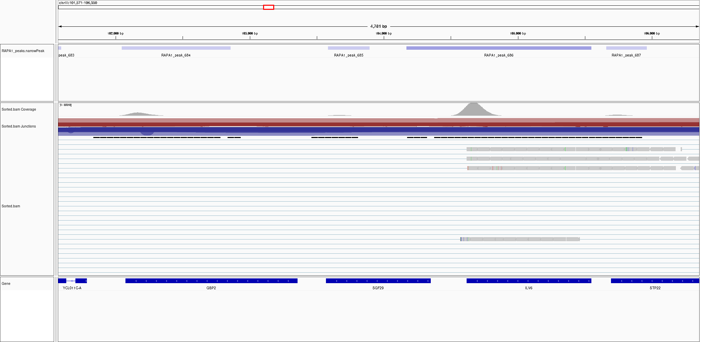

# Load packages

```{r, warning=FALSE, message=FALSE}
library(tidyverse)
library(knitr)
library(kableExtra)

```

# Import the data 

```{r, warning=FALSE, message=FALSE}
setwd("/scratch/sz4633/polyadenylation_cerevisiae/bedtools/")

#import peak files as list
peak_files <- list.files(pattern = "RAPA*")
rawdata <- lapply(peak_files, 
                     read.csv2,
                     sep = "\t",
                     header = F,
                     col.names = c("chromosome",
                                   "peak_start",
                                   "peak_end",
                                   "peak_name",
                                   "score",
                                   "strand_macs",
                                   "Fold_Change_at_peak_summit",
                                   "log10pvalue_at_peak_summit",
                                   "log10qvalue_at_peak_summit",
                                   "relative_summit_position_to_peak_start",
                                   "chromosome_position",
                                   "gene_start",
                                   "gene_end",
                                   "gene_name",
                                   "tss",
                                   "strand"))

#assign names to peak files in list
peak_files <- str_remove(peak_files, "_intersect")
names(rawdata) <- peak_files
rm(peak_files)

```

# Calculate important statistics

- Gene length
- Peak width: info needed to filter out peaks that are too broad
- Peak position on chromosome
- Peak position on gene, compared to the TSS: understand where the peak is in the gene

```{r}
peaks <- rawdata %>% 
  map(~.x %>%
        select(-c("chromosome_position")) %>% #remove non important cols
        mutate(gene_length = gene_end - gene_start, #calculate gene length
               peak_width = peak_end - peak_start, #calculate peak width
               peak_summit_position = peak_start + relative_summit_position_to_peak_start, #calculate peak position on chromosome
               peak_summit_relative_to_tss = #calculate relative peak position compared to tss
                 ifelse(strand == "+", #based on on which strand the gene is, calculating the position is different
                        peak_summit_position - tss,
                        tss - peak_summit_position)))

```

# Check distributions

## Peak width distribution

```{r, warning=FALSE, message=FALSE}
peaks %>%
  bind_rows(.id = "sample") %>% #create one df
  ggplot(aes(x = peak_width)) + 
  geom_histogram() +
  xlim(0,2500)

```

## Check how many peaks are assigned to more than one gene

Peaks can be broad and can overlap with multiple genes. When this happens, a single peak (which has a unique peak name) will be assigned to multiple genes. For example peak_1 might be assigned to gene A and gene B. 



Here we check how many peaks have been assigned to multiple genes. 

```{r }
peaks_assigned_to_genes <- data.frame()

for (i in 1:length(peaks)) {
  tmp <- as.data.frame(table(peaks[[i]]$peak_name))
  tmp <- as.data.frame(table(tmp$Freq))
  tmp <- cbind(tmp, names(peaks[i]))
  peaks_assigned_to_genes <- rbind(peaks_assigned_to_genes, tmp)
}

colnames(peaks_assigned_to_genes) <- c("genes_assigned_to_peak", 
                                       "number_of_peaks", 
                                       "sample")

peaks_assigned_to_genes <-peaks_assigned_to_genes %>%
  group_by(genes_assigned_to_peak) %>%
  summarise(number_of_peaks = sum(number_of_peaks))

kable(peaks_assigned_to_genes) %>%
  kable_styling(full_width = F, position = "left")

```

## Check how many genes have more than one peak

One single gene might contain multiple peaks. This is what we are looking for as it is a sign of different 3'UTR.


```{r}
peaks_per_gene <- data.frame()

for (i in 1:length(peaks)) {
  tmp <- as.data.frame(table(peaks[[i]]$gene_name))
  tmp <- as.data.frame(table(tmp$Freq))
  tmp <- cbind(tmp, names(peaks[i]))
  peaks_per_gene <- rbind(peaks_per_gene, tmp)
}
rm(tmp,i)
colnames(peaks_per_gene) <- c("peaks_per_gene", "frequency", "sample")

peaks_per_gene <- peaks_per_gene %>%
        group_by(peaks_per_gene) %>%
        mutate(peaks_per_gene = as.numeric(peaks_per_gene)) %>%
        summarise(frequency = sum(frequency))

kable(peaks_per_gene) %>%
    kable_styling(full_width = F, position = "left")

```

# Filter out some peaks

## Remove peaks whose summit is too close to the TSS

Some peaks are broad enough that one of their tails is very close to the TSS of a gene. These peaks are for the following gene. However bedtools intersect assign that peak to both genes since it technically overlaps - here remove these types of peaks. 


Quantify how many of these instances we have:

```{r}
kable(sapply(peaks %>% 
               map(~.x %>%
                     filter(peak_summit_relative_to_tss < 50)),
             nrow)) %>%
  kable_styling(full_width = F, position = "left")

```

Remove them

```{r}
peaks <- peaks %>% 
  map(~.x %>%
        filter(peak_summit_relative_to_tss > 50))

```

## Remove peaks that are too broad

Peaks that have a width above 500 will be filtered out since they are too broad

Quantify how many of these instances we have:

```{r}
tmp1 <- as.data.frame(sapply(peaks %>% 
                 map(~.x %>%
                       filter(peak_width > 500)),
             nrow))

tmp2 <- as.data.frame(sapply(peaks %>% 
                 map(~.x %>%
                       filter(peak_width > 600)),
             nrow))
tmp <- cbind(tmp1,tmp2) %>% rownames_to_column()
colnames(tmp) <- c("Sample", "Cutoff_500", "Cutoff_600")
rm(tmp1, tmp2)

kable(tmp) %>%
  kable_styling(full_width = F, position = "left")

```

Remove them 

```{r }
peaks <- peaks %>% 
  map(~.x %>%
        filter(peak_width < 500))

```

## Remove genes with only one peak

Now that we filtered out most of the unwanted peaks, let's find the genes with more than one peak! 

```{r}
peaks <- peaks %>% 
  map(~.x %>%
        group_by(gene_name) %>% 
        filter(n()>1))

```

# Export the peaks

```{r, warning=FALSE}
if (!dir.exists("/scratch/sz4633/polyadenylation_cerevisiae/filtered_peaks/"))
  {dir.create("/scratch/sz4633/polyadenylation_cerevisiae/filtered_peaks/")}

setwd("/scratch/sz4633/polyadenylation_cerevisiae/filtered_peaks/")

for (i in 1:length(peaks)) {
  write.csv2(peaks[[i]], 
             file = paste0(names(peaks)[i], ".bed"), 
             row.names = F)
}
```


